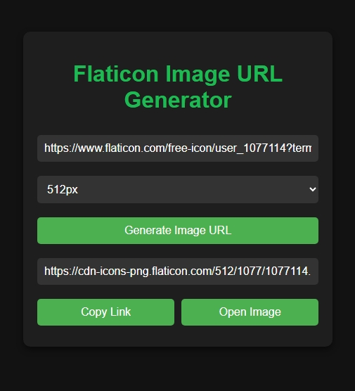

# Flaticon Image URL Generator

A sleek and modern tool to easily generate direct Flaticon image URLs from their page links. This project automates the process of extracting valid image links and allows users to preview or copy them effortlessly.

## Features

- **Generate Direct URLs**: Input any Flaticon page URL to generate its corresponding image URL.
- **Custom Image Sizes**: Select from multiple image sizes (512px, 256px, 128px).
- **Error Handling**: Robust validation for incorrect or unsupported URLs.

## Example

### Input
Flaticon Page URL:  
`https://www.flaticon.com/free-icon/user_1077114?term=user&page=1&position=3&origin=tag&related_id=1077114`

### Output
Generated Image URL:  
`https://cdn-icons-png.flaticon.com/512/1077/1077114.png`

## Screenshots

## Contributing

Contributions are welcome! If you have suggestions, feel free to fork this repository and submit a pull request.

---

### License

This project is licensed under the MIT License.
